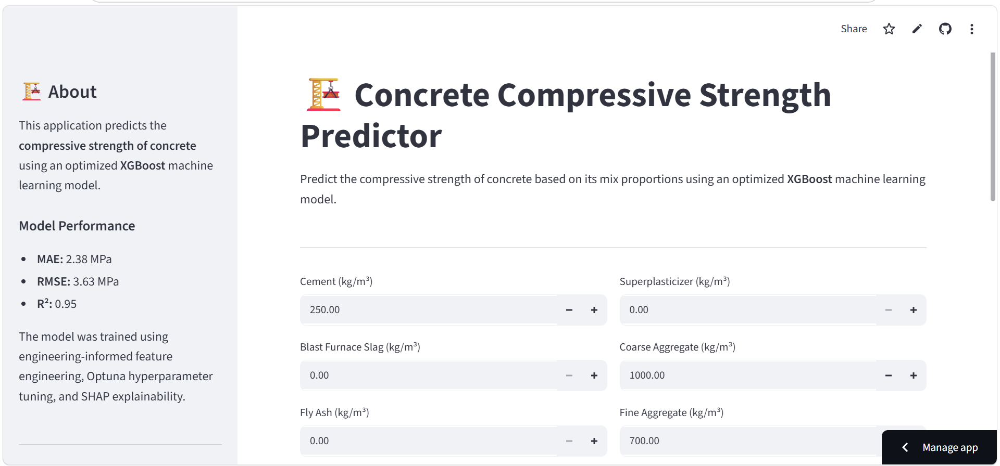
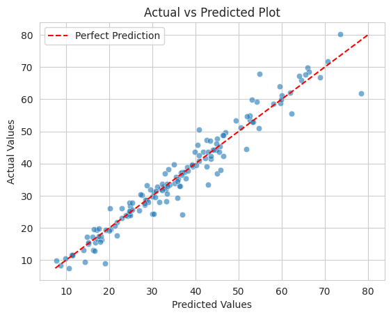
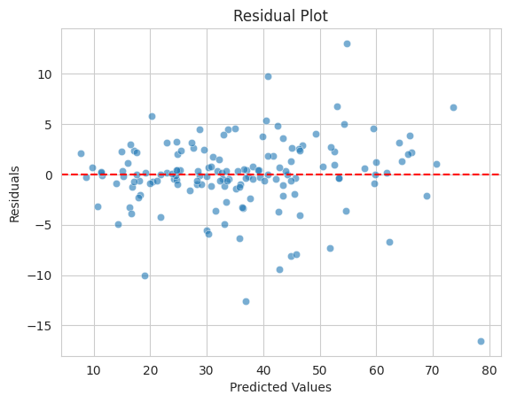
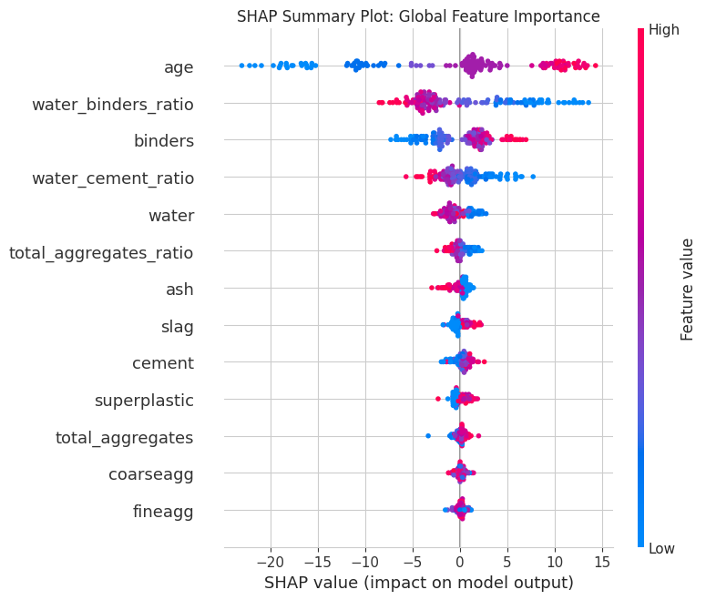

# 🏗️ Concrete Compressive Strength Prediction using Machine Learning

Predicting the compressive strength of concrete is a fundamental task in civil engineering, as it helps engineers assess the quality and structural performance of concrete before construction.

This project develops a machine learning model capable of predicting concrete compressive strength based on concrete mix proportions and curing age.

The workflow covers the complete machine learning lifecycle, including:

- 📊 Exploratory Data Analysis (EDA)
- 🛠️ Feature Engineering
- 🤖 Model Comparison
- 🎯 Hyperparameter Optimization with Optuna
- 🧠 Model Explainability using SHAP
- 🌐 Deployment with Streamlit

---

## 🌐 Live Demo

🚀 **Try the application here:**

**👉 https://YOUR_STREAMLIT_URL**

---

## 🎥 Project Walkthrough

A detailed explanation of the project is available on YouTube.

📺 **Watch here:**

**👉 https://YOUR_YOUTUBE_LINK**

---

# 🚀 Project Overview

This project demonstrates an end-to-end machine learning workflow for predicting the compressive strength of concrete.

The primary objective was to build a highly accurate and interpretable regression model while incorporating engineering knowledge through feature engineering.

## Final Model Performance (Unseen Test Set)

| Metric | Value |
|---------|------:|
| **MAE** | **2.38 MPa** |
| **RMSE** | **3.63 MPa** |
| **R²** | **0.95** |

The final XGBoost model explains approximately **95%** of the variability in concrete compressive strength while maintaining a relatively low prediction error.

---

# 📸 Application Preview

> Replace this image with a screenshot of your Streamlit app.



---

# 📊 Dataset

The dataset consists of **1,030 concrete mix designs**, each described using eight input variables and one target variable.

## Features

| Feature | Description |
|---------|-------------|
| Cement | Cement content (kg/m³) |
| Slag | Blast furnace slag (kg/m³) |
| Ash | Fly ash (kg/m³) |
| Water | Water content (kg/m³) |
| Superplasticizer | Superplasticizer content (kg/m³) |
| Coarse Aggregate | Coarse aggregate (kg/m³) |
| Fine Aggregate | Fine aggregate (kg/m³) |
| Age | Concrete curing age (days) |

### Target Variable

**Concrete Compressive Strength (MPa)**

---

# 🔍 Exploratory Data Analysis

Several exploratory analyses were performed to better understand the dataset.

### Distribution Analysis

Key observations include:

- Concrete strength follows an approximately normal distribution with a slight positive skew.
- Cement exhibits a moderate positive skew.
- Slag, fly ash and superplasticizer are heavily right-skewed, indicating they are absent or used sparingly in many concrete mixes.
- Water and aggregate contents display comparatively symmetric distributions.
- Age is heavily skewed toward younger curing ages.

### Correlation Analysis

Important findings include:

- Cement positively correlates with compressive strength.
- Water negatively correlates with strength.
- Superplasticizer positively contributes to strength.
- Age exhibits a strong positive influence.
- Aggregate contents show relatively weak negative relationships.

---

# 🛠️ Feature Engineering

To better capture engineering relationships within concrete mix designs, several new features were created.

| Engineered Feature | Description |
|-------------------|-------------|
| Water-Cement Ratio | Water ÷ Cement |
| Binder Content | Cement + Slag + Fly Ash |
| Water-Binder Ratio | Water ÷ Total Binder |
| Total Aggregates | Coarse + Fine Aggregate |
| Aggregate Ratio | Total Aggregates ÷ Cement |
| Log(Age) | Logarithmic transformation of curing age |

### Engineering Insights

Feature engineering substantially improved predictive performance.

Notable findings include:

- ✅ Water-Binder Ratio became the strongest negative predictor.
- ✅ Binder Content became the strongest positive predictor.
- ✅ Log-transformed Age captured the nonlinear strength gain over time.

---

# 🤖 Machine Learning Models

Several regression algorithms were evaluated.

| Model | MAE | RMSE | R² |
|------|------:|------:|------:|
| Random Forest | 3.27 | 5.21 | 0.896 |
| XGBoost | 3.03 | 5.27 | 0.893 |
| Gradient Boosting | 3.60 | 5.45 | 0.886 |
| K-Nearest Neighbors | 4.70 | 6.42 | 0.841 |
| Decision Tree | 4.64 | 7.44 | 0.787 |
| Linear Regression (Baseline) | 5.84 | 7.95 | 0.757 |
| Support Vector Machine | 5.72 | 8.03 | 0.752 |

Linear Regression served as the baseline model.

Tree-based ensemble methods significantly outperformed the baseline.

---

# 🎯 Hyperparameter Optimization

Hyperparameter optimization was performed using **Optuna**.

Both Random Forest and XGBoost were optimized.

The optimized **XGBoost** model achieved the best validation performance and was selected as the final model.

---

# 🧠 Model Explainability (SHAP)

SHAP (SHapley Additive exPlanations) was used to interpret the trained model.

The most influential features were:

1. Age
2. Water-Binder Ratio
3. Binder Content
4. Water-Cement Ratio
5. Water

These findings align closely with established concrete technology principles.

- Older concrete generally develops higher strength.
- Higher binder content increases compressive strength.
- Lower water-binder ratios produce stronger concrete.
- Increasing water content generally reduces strength.

---

# 📈 Model Evaluation

The final model demonstrated excellent predictive performance.

### Actual vs Predicted

> Replace with your figure.



---

### Residual Analysis

> Replace with your figure.



---

### SHAP Summary Plot

> Replace with your figure.



---

# 💻 Streamlit Web Application

A Streamlit application was developed to allow users to interactively predict concrete compressive strength.

### Features

- Enter concrete mix proportions
- Predict compressive strength instantly
- View engineered mix characteristics
- Concrete strength classification
- User-friendly engineering interface

---

# 📂 Repository Structure

```text
concrete-compressive-strength-prediction/
│
├── app.py
├── README.md
├── requirements.txt
├── LICENSE
├── .gitignore
│
├── data/
│   └── concrete.csv
│
├── models/
│   └── concrete_strength_model.joblib
│
├── notebooks/
│   └── concrete-compressive-strength-project.ipynb
│
└── images/
    ├── app.png
    ├── actual_vs_predicted.png
    ├── residual_plot.png
    └── shap_summary.png
```

---

# ⚙️ Installation

Clone the repository

```bash
git clone https://github.com/YOUR_GITHUB_USERNAME/concrete-compressive-strength-prediction.git
```

Navigate into the project

```bash
cd concrete-compressive-strength-prediction
```

Install dependencies

```bash
pip install -r requirements.txt
```

Run the Streamlit application

```bash
streamlit run app.py
```

---

# 🚀 Future Improvements

Potential enhancements include:

- Deep Learning models
- Prediction uncertainty estimation
- Batch prediction from CSV files
- Mix design optimization for target strength
- Confidence intervals for predictions
- Docker containerization
- Cloud deployment
- Integration into structural engineering workflows

---

# 🛠️ Technologies Used

- Python
- Pandas
- NumPy
- Scikit-learn
- XGBoost
- Optuna
- SHAP
- Matplotlib
- Plotly
- Streamlit
- Joblib

---

# 📚 References

- Yeh, I. C. (1998). *Modeling of Strength of High-Performance Concrete Using Artificial Neural Networks.*
- UCI Machine Learning Repository – Concrete Compressive Strength Dataset.
- Scikit-learn Documentation
- XGBoost Documentation
- Optuna Documentation
- SHAP Documentation

---

# 👨‍💻 Author

## Uche

Civil Engineering Graduate | Incoming MSc Structural Engineering Student | Machine Learning Enthusiast

Passionate about applying Machine Learning, Artificial Intelligence and Finite Element Analysis to solve real-world civil and structural engineering problems.

---

## ⭐ If you found this project interesting...

Consider giving the repository a ⭐ on GitHub!

It helps others discover the project and supports future engineering-focused machine learning work.
